```{=html}
<style>
body{
  color: #000000;
  background-color: #D5CABC;
}
pre{
  background-color: #FFF8EE;
}
pre:not([class]){
  background-color: #B6A999;
}
.toc-content{
  padding-left: 10px;
  padding-right: 10px;
}
.col-sm-8 {
  width: 75%;
}
code {
  color: #000000;
}
pre code {
  white-space: pre-wrap;
}


</style>
```


------------------------------------------------------------------------

# Final-term Exercise

Choose two questions among the ones listed below and develop an answer
for each of them. Argument your answer using detailed explanations and R code.

# Question 1 - Regression Model Selection Theory

Explain the regression model selection procedure in the context of time
series. What procedures, tools and criterion should be used to select a
model? List and discuss them and provide an example of such model
selection procedure.\

*Disclaimer*: Question 1 utilities resources from the **Forecasting: Principles and Practice (3rd ed)** by Rob J Hyndman and George Athanasopoulos in addition to the slides from the course, Forecasting with Applications in Business.\ 

In regression modeling, two main objectives are generally assigned:\

1.  to generate accurate forecasts that include a distribution of
    expected outcomes, and\

2.  to comprehend the relationship between the factors and the response,
    such as estimating trends and seasonality (similar to time series
    decomposition) and gauging the impact of exogenous factors such as
    marketing campaigns or new competitors.\

These two objectives may be approached independently, and may lead to
developing different models. However, it is crucial to note that in
order for the model to be practical for predictive purposes, the factors
must be more predictable than the response variable.\

## The Linear Model

In regression models, their aim is to construct a linear relationship
between the forecast variable (regressand, dependent, or explained
variable), $y$, as a function of the predictor variables (regressors,
independent, explanatory variables), represented by $x$. Specifically in
a time series context,\

-   The response is a time series $y_t$ and\

-   The factors $x$ may be also time series $x_t$ or they can be the
    time itself (year, month, hour, etc.).\

There are two models that could be used within this regression space:
simple or multiple. For this specific question, we will mainly focus on
simple linear regression with a few added comments about multiple since
there is another question that dives into that option more.

### Simple Linear Regression

In its simplest form, a regression model involves a linear relationship
between the forecast variable, denoted by $y$, and a single predictor
variable, $x$, as shown in the following equation:

$$y_t = β_0 + β_1x_{1,t} + ε_t$$

where $β_0$ and $β_1$ are the intercept and slope of the line,
respectively, and $ε_t$ is the error term. The intercept or baseline
value $β_0$ represents the predicted value of $y$ when $x$ equals zero,
while the slope $β_1$ represents the average predicted change in $y$
that results from a one-unit increase in $x$. When referring to the
error term, $\epsilon_t$, it corresponds to the deviation from the
underlying linear model that captures anything that may impact $y_t$
other than $x_t$.

### Multiple Linear Regression

Unlike simple linear regression, multiple linear regression contains two
or more regressors. This linear regression model of a response $y_t$ on
the $p$ features $x_t = (x_{1,t}, ...,x_{p,t})$ is of the following
equation:

$$y_t = β_0 + β_1x_{1,t} + ... + β_px_{p,t} + ε_t$$

where $y$ is the variable to be forecast and$x_1,...,x_k$ are the $k$
predictor variables. It is important to note that each of the predictor
variables must be numerical. The coefficients $β_1,...,β_k$ in the model
represent the effect of each predictor after accounting for the impact
of all the other predictors. Hence, these coefficients measure the
marginal effects of each predictor variable.

## Statistical Assumptions

First, it is assumed that the linear model provides a reasonable
approximation of reality. This implies that the relationship between the
predictor variables ($x$) and the forecast variable ($y$) satisfies the
linear equation.\

Secondly, assumptions are made about the residuals $(\epsilon_t)$ on how
they are independent and identically distributed (IID) from a normal
distribution with mean zero and variance $\sigma^2$, i.e. $\epsilon_t$
\~ $N(0,\sigma^2)$. This implies that the error made by the model when
predicting the response variable are characterized by the following
properties according to the lecture:\

-   of mean zero: in average, the model does not make any error.\

-   normally distributed: the error is symmetric and satisfies the 68 −
    95 − 99.7 rule.\

-   of standard deviation σ: the amplitude of the error is estimated.\

-   independent: the past errors do not provide any information on the
    future ones (e.g. it is not because the error in $t + 1$ is large
    that the error in $t$ will be small). 

An additional essential assumption in linear regression is that each
predictor variable $x$ is not a random variable. In observational data,
particularly in business and economics, controlling the value of x is
infeasible; hence, this assumption is made. Overall, some of these
assumptions will not hold in practice, and their validity must be
examined through appropriate tests. Later, we will discuss more about
the specific model assumptions.

## Prediction

The prediction of the forecast variable, $y_t$, given the predictor
variables, $x_t$, is expressed as
$$\hat{y}_t = \hat{β}_0 + \hat{β}_1x_{1,t} + \hat{β}_2x_{2,t} + ... + β_px_{p,t}$$

It is important to note that predictions can be made for both past and
future values. If the current last time of observation is denoted as
$T$, predictions in the past $(t ≤ T)$ can be used to evaluate the
performance of the model or to explore hypothetical scenarios. Such
predictions are referred to as **fitted values**. On the other hand,
predictions in the future $(t > T)$ can also be used to evaluate the
performance of the model or to make forecasts. These predictions of
$y_t$ within the training set are used to estimate the model and not
actual forecasts of future values of $y_t$.

## Estimation

In practical applications, the values of the coefficients
$β_0, β_1, ..., β_k$ are not known, as we only have a collection of
observations. Therefore, these coefficients must be estimated from the
data. The least squares principle is a commonly used method for
selecting the coefficients by finding the minimum of the sum of squared
errors. Specifically, we choose the values of those betas $(β)$ that
minimize the following expression:
$$\sum_{t=1}^{T} \epsilon_1^2 = \sum_{t=1}^{T}(y_t - \beta_0 - \beta_1x_{1,t} - \beta_2x_{2,t} - ... - \beta_kx_{k,t})^2$$

This approach is known as the ordinary least squares (OLS) estimation.
The process of finding the best estimates of the coefficients is often
referred to as "fitting" or "training" the model to the data. To
estimate the coefficients, the notation of $\hat{β}_0,...,\hat{β}_k$
will be used. From this, the fitted values and the residuals are then
computed through:
$${\hat{y}_t = \hat{β}_0 + \hat{β}_1x_{1,t} + ... + β_px_{p,t}}, \:\:\: e_t = y_t - \hat{y}_t$$

## Fitting the Model

According to the book's `Section 7.2`, the `TSLM()` function is a tool
used to fit linear regression models to time series data. Although it
operates similarly to the widely used `lm()` function for linear models,
`TSLM()` provides additional features for handling time series data.

## Predictors and Features

There are two main types of variables that will be reviewed frequently
used when using regression for time series data. If a series contains a
trend and seasonal component, it is common to include them into the
model feature. For instance, a linear trend can be modeled using
$x_{1,t} = t$ as a predictor, $$y_t = β_0 + β_1t + \epsilon_t$$

where $t = 1,...,T$. Within the `TSML()` function, `trend()` can be
specified.\

Seasonality elements are typically represents by categorical variables
indicating the season of $t$. In relation to quarterly data, there are
three dummy variables are created so that it can be easily interpreted.
In this example, the interpretation of each of those three coefficients
is the measure of the effect of that category relative to the omitted
category. In the `TSLM` function, it will automatically handle this
situation if the analyst specifies `season()`. 

To capture these components, the prediction equation can formally be
written as:
$$y_t = β_0 + β_\textsf{I}t + β_\textsf{II}\delta_ \textsf{II}(Q_t)+ β_\textsf{III}\delta_ \textsf{III}(Q_t)+ β_\textsf{IV}\delta_ \textsf{IV}(Q_t)$$

where the $\delta$ stands for the indicator variable
$$ \delta_ \textsf{II}(x) =
   \begin{cases}
     0, & \text{if x ≠ II} \\
     1,  & \text{if x = II}
   \end{cases}
$$

and $Q_t$ is the quarter at time $t$. Reminder, $Q$ is an example, but
other time durations can be inputted. 

Other than trend and seasonality, there are other `special events` that
are categorical. These are called intervention variables, which could be
examples of promotions, new competitors, or industrial action that have
an effect on the variable to be forecast. As seen with seasonality,
intervention effects that last only one period are considered a "spike"
variable, which is equivalent to a dummy variable handling an outlier.
There are different levels of interventions, ones that have an immediate
effect or even a permanent one. From the course, there were three
examples of tuning variables that are relevant to interventions. The
effect of interventions or holidays may not necessarily occur within a
single period, but can be delayed or prolonged. When constructing a
model, variables are included with the intention of improving prediction
accuracy. For instance, monthly sales of a product A can be predicted
using a linear trend and an event indicator that accounts for a
promotion:\
$$y_t = \beta_0 + \beta_1t + \beta_2p_t + \epsilon_t$$

where $p_t$ = 1 if the promotion occurs at month $t$, 0 otherwise.\
Then $b_2$ is the effect of the promotion at $t$, hopefully $b_2 > 0$.\

Additional context will be given in the *Feature Selection* section of
this analysis.

## Model Evaluation

The evaluation of a model can be carried out in two directions:\

1.  by examining the quality of the predictions or the goodness-of-fit\

2.  by checking the conformity between the model assumptions and the
    data.\

Notably, the evaluation is conducted in-sample, meaning that the dataset
used to fit the model is the same one used for evaluation. To estimate
the model performance of the model on new data, it is necessary to
evaluate the model on a separate test set or to use a method such as
cross validation. This concept will be discussed later on.

### Goodness-of-fit

A commonly used metric to assess the goodness-of-fit of a linear
regression model is the coefficient of determination, also known as
$R^2$. There are two ways to compute this measure:\
**The (multiple)** $R^2$
$$R^2 =   \frac{\sum_{t}(\hat{y}_t -\bar{y}_t)^2}{\sum_{t}(y_t -\bar{y}_t)^2}$$

**The adjusted** $R^2$
$$R_a^2 =   \frac{\sum_{t}(\hat{y}_t -\bar{y}_t)^2/(T - p -1)}{\sum_{t}(y_t -\bar{y}_t)^2/(T - 1)}$$

The $R^2$ ranges from 0 to 1, with values closer to 1 indicating a
better fit. For a simple linear regression model with only one feature
$x_1$, $R^2$ can be calculated as the square of the correlation between
the observed $y$ values and $x_1$. For a multiple regression model with
several features, $R^2$ can be seen as a generalization of the (square
of) correlation between $y$ and the multiple $x$'s.\

However, a potential issue with $R^2$ is that adding more parameters to
the model can only increase its value, even if the added parameters do
not actually improve the model's predictive power. To address this
problem, the adjusted $R^2$ takes into account the number of parameters
in the model. The adjusted $R^2$ is a modified version of that penalizes
the inclusion of unnecessary variables and provides a more accurate
measure of the model's goodness of fit. An additional tool that is
relevant to the goodness-of-fit is to graph the fitted values
$(\hat{y}_t)$ against the actual values $(y_t)$. The better the fit, the
closer to the (0,1)-diagonal of the points.

### Standard Error of the Regression

Another way to assess how well the model fits the data is through the
standard deviation of the residuals, commonly referred to as the
"residual standard error." The equation is as follows:
$$\hat{\sigma}_e^2 =\sqrt{\frac{1}{(T -k - 1)}\sum_{t=1}^{T} \epsilon_t^2}$$

It is important to note that we divide by $T - k - 1$ since we have
estimated $k+1$ parameters (the intercept and a coefficient for each
predictor variable) when computing the residuals. The standard error
reflects the magnitude of the average error that the model produces, and
we can compare this error to the sample mean of $y$ or the standard
deviation of $y$ to gain perspective into the accuracy of the model.

### Model Assumptions

In the *Statistical Assumptions* section, training-set errors, also
known as residuals, were discussed. We can define them as the
differences between the observed $y$ values and the corresponding fitted $\hat{y}$ values, $e_t = y_t - \hat{y}_t$. Each residual is an
unpredictable component of the associated observation.\

The model's underlying distributional assumptions can be described by
$\epsilon_t$ \~ $N(0,\sigma^2)$. In order to verify that the model is
consistent with the data, the following conditions should be examined:\

1.  the residuals have a constant mean of 0,\

2.  a constant variance of $\sigma^2$,\

3.  a normal distribution,\

4.  and are independent.\

These assumptions are typically evaluated in some capacity, although the process can be somewhat arbitrary. Now, we will review some diagnostic
tools for assessing these assumptions. This step is crucial after
selecting the regression variable(s) and fitting the model, the
assumptions need to be checked if they are satisfied.

#### 1 and 2: Residual Mean and Variance

In linear regression, it is assumed that the residuals have a constant
mean of 0 and a constant variance. One way to check if this assumption
holds is by plotting the residuals against the fitted values through
scatterplots. If the assumption holds, we would expect the residuals to
be randomly scattered around 0 without any patterns. However, if there
is a departure from this assumption, it will be evident by a systematic
deviation from 0 and/or varying scatter of the residuals.

#### 3: Normality of the Residuals

A QQ-plot can be utilized to assess the normality assumption by
comparing the distribution of the residuals with the normal
distribution. Deviation from normality can be detected by observing a
significant deviation from the diagonal line on the plot. This also
checks that looking at the correlation is enough for independence. In
addition, a histogram is another tool that could be reviewed to test if
the normality exists as it makes the calculations for the prediction
intervals easier.

#### 4: Independence of the Residuals

When dealing with time series data, it is often observed that the value
of a variable in the current time period is closely related to its value in the previous periods. Therefore, it is important to examine the
independence of the residuals. This assumes that there is a natural
order to the residuals, as determined by time. The objective is to
ensure that the error term at time $t$, denoted as $\epsilon_t$, is not
dependent on the error term at time $t-1$, denoted as $\epsilon_{t-1}$.
In the case of normally distributed residuals, this can be achieved by
examining the auto-correlation of the residuals. A departure from
independence is indicated by non-zero auto-correlations. It is worth
noting that while unbiased estimates can still be obtained from models
with correlated residuals, prediction and confidence intervals may be
too narrow, leading to potentially inaccurate inferences.

##### Auto-Correlation Function (ACF)

This section will give further details about the auto-correlation
function. The correlogram of residuals will show some changing variation
over time, which could in turn potentially make the prediction interval
coverage inaccurate. To obtain the auto-correlation of a time series, we
can calculate the measure of correlation with itself, lagged by $k$
units between $z_t$ and $z_{t-k}$, $k \geq 1$:
$$r_k =   \frac{\sum_{t=k+1}^T({z}_t -\bar{z})(z_{t-k}-\bar{z})}{\sum_{t=1}^T(z_t -\bar{z})^2}$$

where $\bar{z} = T^{-1}\sum_tz_t$ is the average of the times series.\

By examining this further, we can rewrite the same formula as:
$$r_k =   \frac{(T-1)^{-1}\sum_{t=k+1}^T({z}_t -\bar{z})(z_{t-k}-\bar{z})}{(T-1)^{-1}\sum_{t=1}^T(z_t -\bar{z})^2}$$

By including $(T-1)^{-1}$ is the numerator and the denominator, the
upper term represents an estimate of the covariance $cov(z_t, z_{t-k})$,
while the lower term represents an estimate of the variance $var(z_t)$.
The resulting ratio is an estimate of the correlation
$cov(z_t, z_{t-k})$. However, this estimate is biased because the
numerator should be $(T - k + 1)$ instead of $T$.\

For the estimate to be accurate, it is necessary that the following
conditions hold true:\

-   The average of $z_t$ is constant over time.\

-   The variance of $z_t$ is constant over time.\

-   The covariance of $z_t$ and $z_{t-k}$ is constant over time.\

In this case, $\bar{z}$ is an estimate of the average, and its use in
the numerator and denominator is justified. The estimate of the variance
and covariance are also meaningful, and hence the value of $r_k$ can be
accurately interpreted. A series $z_t$ satisfying these assumptions is
known as stationary.\

According to section 9.1, "a stationary time series is one whose
statistical properties do not depend on the time at which the series is
observed. Thus, time series with trends, or with seasonality, are not
stationary --- the trend and seasonality will affect the value of the
time series at different times. On the other hand, a white noise series
is stationary --- it does not matter when you observe it, it should look
much the same at any point in time." This is an important distinction
because when performing regression analysis on time series data, the ACF
is calculated on the residuals $\epsilon_t$ under the assumption that
the series is stationary. To ensure that the model assumption holds
true, the residuals $\epsilon_t$ need to be checked so that they do not
exhibit significant auto-correlation $r_k$ at any lag $k$. If the
residuals satisfy the condition $r_k$ = 0 for all $k$, the series is
referred to as a white noise. For a white noise, the estimated
correlation $r_k$ is expected to fall within the range of $±2/\sqrt{T}$
at approximately 95% confidence interval.

## Feature Selection

When dealing with multiple possible predictors in a regression model, it
is crucial to have a proper strategy for selecting the most appropriate
predictors. There are two common but flawed approaches that are not
recommended. The first one involves plotting the forecast variable
against each predictor and dropping any that do not show an apparent
relationship. However, this is an invalid method as it does not consider
the potential impact of other predictors and can lead to the exclusion
of useful variables. The second approach is to perform a multiple linear
regression with all predictors and discard those with a p-value greater
than 0.05. This method is also invalid as statistical significance does
not always indicate predictive value. Instead, we should use measures of
predictive accuracy to evaluate the performance of different models.
This section introduces three such measures, which can be obtained using
the `glance()` function.\

### Adjusted $\text{R^2}$

In discussed in a previous section (\*Goodness-of-fit), it was mentioned
that the coefficient of determination, also known as (multiple) $R^2$
was a good measurement assess the goodness-of-fit of a linear regression
model. However, it is not a good metric when it comes to predictive
abilities. It considered the fit on historical data but not how well the
model will predict future data. The book also references the use the sum
of squared errors (SSE), which will give the minimum error of the model
to select. Once again, this metric is problematic because it will always
choose the model with the most variables. To overcomes these issues, one
should use the Adjusted $R^2$ which will not increase when there are
more predictors introduced into the model. To find Adjusted $R^2$,
calculate: $$\bar{R}^2 = 1 - (1-R^2)\frac{T-1}{T - k - 1} $$

where $T$ is the number of observations and $k$ is the number of
predictors.

### Cross Validation

This is an alternative method to evaluate the performance of a model in
predicting new data. This approach involves:\

-   Produce a random split of the data set into $k$ disjoint subsets
    (typically $k$ = 10).\

-   Take aside one subset, and fit the model on the rest of the data.\

-   Predict the subset and compute the error on it (MSE, other...), call
    it $S_1$.\

-   Repeat this for each of the subsets and get $S_1, . . . ,S_k$.\

-   Compute the average error $\bar{S}$ and its standard deviation
    $sd(S)$.\

#### CV Limitations

The average error obtained from cross-validation serves as an estimate
of the error that a model would make when applied to new data, as the
error is computed on a previously unseen portion of the data. While
$k$-fold cross-validation is considered the best method for evaluating
model performance, it has certain limitations.\

1.  It can be computationally intensive as k different models must be
    fit.\

2.  $k$ should be chosen with respect to the sample size, making
    cross-validation unsuitable for small datasets.\

3.  The measured error assumes that the subset of data held out during
    validation is representative of the new sample.\

This third limit is especially problematic for time series data with
trends, where future data may not be well-represented by past
observations. Therefore, adaptation of cross-validation techniques is
necessary.\

Classical leave-one-out cross validation can also be used for selecting
predictors in regression models, which is faster and makes more
efficient use of the data. It can be approximated by the Generalized
Cross Validation (GCV):
$$GCV = \frac{1}{T} \sum_{t=1}^T\frac{(y_t - \hat{y}_t)^2}{(1 - h_t)^2} $$

-   $\hat{y}_t$'s are the fitted values by the model fitted on all the
    data.\

-   $h_t$'s are the diagonal elements of the so-called hat-matrix H:
    $$H = X({X^\intercal}X)^{-1}X^\intercal $$

where $X$ is the design matrix of the regression model.\
The GCV only requires one model fit, making it computationally
efficient.

### AIC

Other than Adjusted $R^2$, the Akaike Information Criterion (AIC) is
another method that starts from a full model and trying to select/remove
some of the features if they do not bring enough prediction capacity.
Minimizing the AIC value often results in the selection of the best
model for forecasting purposes. When the sample size, $T$, is large,
minimizing the AIC value is equivalent to minimizing the CV value. We
define AIC as: $$AIC = T\log{MSE} + 2(p+2) $$

where MSE stands for the regular mean square of the errors.

$$MSE = \frac{1}{T}\sum_{t=1}^{T-(p+1)}\sum_{t=1}^T(y_t - \hat{y}_t)^2 $$

Note that there are $p + 1$ coefficients (including $\beta_0$) and
$p + 2$ parameters in the model (including $\sigma$).

For further details on forecasting and prediction intervals, please read
*Forecasting: Principles and Practice, Chapter 7* for more information.

# Question 1 - Regression Model Selection Application
```{r message=FALSE, warning=FALSE, include=FALSE}
# Clear the database
rm(list=ls()) 
graphics.off()
shell("cls")
```


https://bookdown.org/mpfoley1973/time-series/regression.html#exploratory-analysis

### Resources 
- https://otexts.com/fpp3/non-seasonal-arima.html\
- Forecasting with Applications in Business
Lecture\

# Question 4

Present both the ACF and PACF functions and their plots. Discuss their properties, similarities and differences and explain their uses when modelling ARMA and ARIMA models. Present an example of using these tools to fit a model on a simulated ARMA/ARIMA process.\

*Disclaimer*: Question 4 utilities resources from the **Forecasting: Principles and Practice (3rd ed)** by Rob J Hyndman and George Athanasopoulos, slides from the course, Forecasting with Applications in Business, and an article from Towards Data Science.\ 

The examination of autocorrelation is a crucial component of exploratory data analysis when forecasting time series. By identifying patterns and assessing randomness, autocorrelation analysis plays a significant role. This is particularly crucial when utilizing an auto-regressive–moving-average (ARMA) model for prediction, as it assists in determining its parameters. The analysis necessitates examining Autocorrelation Function (ACF) and Partial Autocorrelation Function (PACF) plots.

## Auto-Regression (AR) Model 
In Question 1, multiple linear regression models were briefly covered, which are used for forecasting a variable of interest by means of a linear combination of predictors. Conversely, in an auto-regressive model, the variable of interest is forecasted using a linear combination of past values of the variable, hence the name "auto-regression" since the regression is against itself.\

An auto-regressive model of order $p$can be written as
$$y_t = c + \phi_1y_{t-1} + \phi_2y_{t-2} + ... + \phi_py_{t-p} + \epsilon_t $$
 

where $c$ is the constant and $\epsilon_t$ represents white noise, $e_t$ ~$~WN(0,\sigma^2)$. Typically, $e_t$ ~$~NID(0,\sigma^2)$. This resembles a multiple regression, but with delayed values of $y_t$ acting as predictors (current observations) that can be predicted by a linear combination of the past observations $y_{(t)}$. This is known as an $AR(p)$ model, which is an auto-regressive model of order $p$.

These models can efficiently handle various time series patterns. Specifically, there are two series from an AR(1) model and an AR(2) model. 
```{r} 
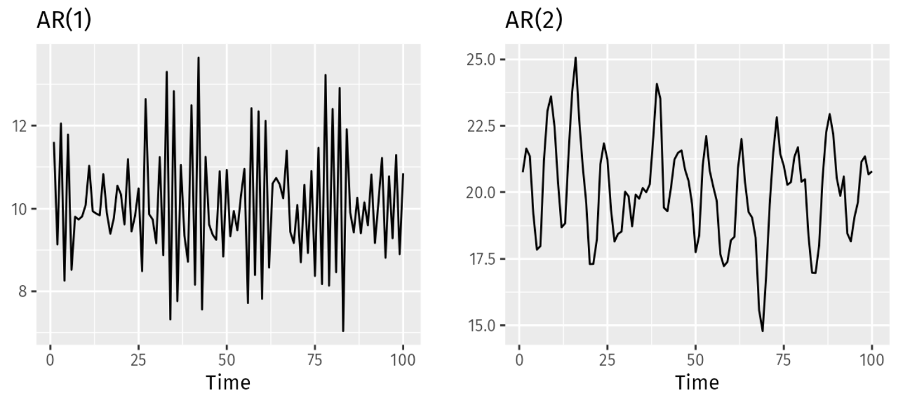 
``` 

By changing the parameters $\phi_1,...\phi_p$, different time series patterns may be produced. The variance of the error term $(\epsilon_t)$ or white noise variable $(\sigma^2)$ only impacts the scale of the series, not the patterns.

For an AR(1) model,\
- when $\phi_1 = 0$, $y_t$ is a white noise.\
- when $\phi_1 = 1$, $c = 0$, $y_t$ is a random walk.\
- when $\phi_1 = 1$, $c \neq 0$, $y_t$ is a random walk with a drift.\
- when $\phi_1 < 0$, $y_t$ tends to oscillate.\

For the AR models to be stationary, some restriction on the
parameters are needed\
- AR(1): $|\phi_1| < 1$.\
- AR(2): $|\phi_2| < 1$, $\phi_1 + \phi_2 < 1$, $\phi_2 − \phi_1 < 1$.\
For $p ≥ 3$, more complex restrictions are required.\

To determine the order of an $AR$ model, it is necessary to examine the PACF.

## Moving Average (MA) Model 

Rather than utilizing prior values of the forecast variable in a regression, a moving average model employs previous forecast errors in a regression-like fashion expressed as:
$$y_t = c + \epsilon_t + \theta_1\epsilon_{t-1} + \theta_2\epsilon_{t-2}+...++ \theta_q\epsilon_{t-q}$$

where $\epsilon_t$ is white noise, $e_t$ ~$~WN(0,\sigma^2)$. This is referred to as an $MA(q)$ model, which is a moving average model of order $q$. However, since the values of $\epsilon_t$ are not observable, it is not a typical regression.\

It is important to note that each value of $y_t$ may be viewed as a weighted moving average of the past few forecast errors (although the coefficients do not typically add up to one). Nonetheless, moving average models should not be confused with the moving average smoothing. Moving average models are utilized to forecast future values, whereas moving average smoothing is employed to estimate the trend-cycle of past values.\

From the textbook, they demonstrate two models: $MA(1)$ and $MA(2)$. They have different parameters, $\theta$, that will result in different time series patterns. Just as the auto-regressive models, the variance of the error term $(\epsilon_t)$ will only change the series' scales, but not the patterns. 

```{r} 
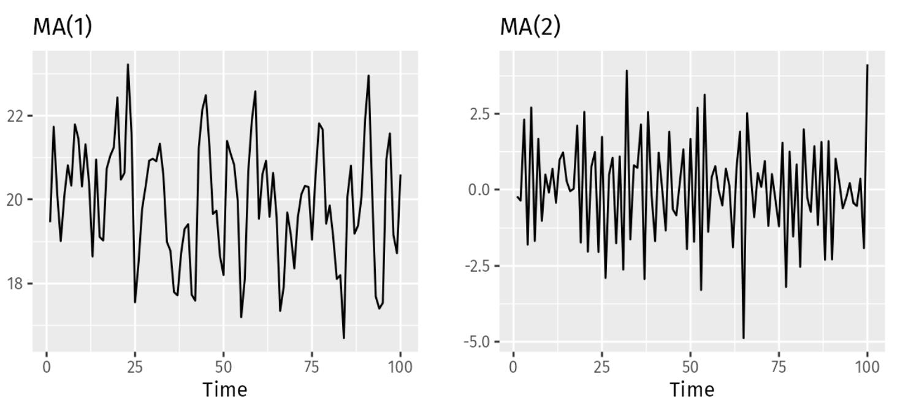
``` 

As previously covered, $MA(q)$ can be considered as an indirect regression model as the errors are not observable directly. Its purpose is to carry forward the past forecasting error over time. Let's consider $MA(1)$:
$$y_t = c + \epsilon_t + \theta_1\epsilon_{t-1}$$

The variable $y_t$ can be expressed as the sum of its mean value $c$ and an innovation term, which is the sum of the current error $(\epsilon_t)$ and a fraction $(θ_1)$ of the previous error $(\epsilon_{t-1})$, where the errors are assumed to be white noise with variance $(1 + θ_1^2)σ^2$. If the previous value $y_{t-1}$ was incorrectly predicted with a very large positive error $(\epsilon_{t-1})$, it is expected that the current value $y_t$ will be approximately equal to $c$ plus an error term with variance $σ^2$, plus a fraction $(θ_1)$ of the large previous error. This suggests that if a mistake was made in one direction, a similar mistake may occur again unless corrective action is taken.

To determine the order of an $MA$ model, it is necessary to examine the ACF.

## AR and MA
An $AR(p)$ model, which is stationary, can be represented as an $MA(∞)$ model. This can be illustrated by using the example of an $AR(1)$ model and applying repeated substitution. That is:
$$y_t = \sum_{j=0}^{∞}\phi_1^j\epsilon_{t-1}$$

Provided $-1 < \phi_1 < \phi_1^k$, the value of $\phi_1^k$ will get smaller as $k$ gets larger.\
  
Under certain conditions, the opposite property also holds true. To demonstrate, let's take the example of an $MA(1)$ model.\
$$y_t = \epsilon_t + \theta_1\epsilon_{t-1}$$

Then in its $AR(∞)$ representation, the most recent error can be written as a linear function of current and past observations:
$$\epsilon_t = \sum_{j=0}^{∞}(-1)^j\phi_1^jy_{t-1}$$

For the given relationship to hold true, it is necessary for the term on the right-hand side to converge in some sense If this condition is met, the process is considered to be invertible. Invertibility can be ensured by imposing certain constraints:\

- $MA(1)$: $|\theta_1| < 1$\

- $MA(2)$: $|\theta_2| < 1$, $|\theta_2| + |\theta_1| > −1$, and $|\theta_1| − |\theta_2| < 1$.\ 

- More complex conditions are required for $q ≥ 3$.\

**Note**: Any $AR$ is inveritable, any $MA$ is stationary.\

$ARMA$ models and their extension, $ARIMA$, differ from regression models in that they do not explicitly establish the relationship between $y_t$ and covariates $x_t$. Instead, they model the link between $y_t$ and its past values, such as $y_{(t-1)}$, using linear models.

## ARMA Model
When a time series $y_t$ contains both $AR(p)$ and $MA(q)$ components, it is referred to as an $ARMA(p, q)$ process. The forecast for such a process depends on both the past values and past errors:
$$y_t = c + \phi_1y_{t-1} +  ... + \phi_py_{t-p} + \theta_1\epsilon_{t-1}+...+\theta_q\epsilon_{t-q} + \epsilon_t $$

where $\epsilon_t$ ~ $WN(0,\sigma^2)$. $ARMA(0,q) = MA(q)$ and $ARMA(p,0) = AR(p)$.\

For an $ARMA$ model to be meaningful, it must be both stationary and invertible. The same conditions that are applied for $AR$ and $MA$ models are also applicable in this case. However, there are additional conditions that must be satisfied for the existence of an $ARMA$ model. In the case of an $ARMA(1, 1)$ model, the condition is: $\phi_1 + \theta_1 \ne 0$.

## ARIMA Model
By combining differencing$^1$ and $ARMA$ models, one can obtain AutoRegressive Integrated Moving Average models, commonly known as $ARIMA(p, d, q)$ models. These models are represented by the following equation:
$$y_t^` = c + \phi_1y_{t-1}^` + ... + \phi_py_{t-p}^` + \theta_1\epsilon_{t-1} + ... + \theta_q\epsilon_{t-q} + \epsilon_t$$,

where  $y_t^`$ is the differenced series (it may have been differenced more than once). The “predictors” on the right-hand side include both lagged values of   $y_t$ and lagged errors. We call this an $ARIMA(p, d, q)$ model, where: 

- $p$ =	order of the autoregressive part;\

- $d$ =	degree of first differencing involved;\

- $q$ =	order of the moving average part.\

The exact stationarity and invertibility conditions that are used for $AR$ and $MA$ models also apply to an $ARIMA$ model.

*Differencing*$^1$: A method of transforming a non-stationary time series into a stationary one. This is an important step in preparing data to be used in an $ARIMA$ model [2].\

Since $AR$ and $MA$ focus on $p$ and $q$ respectively, here is a quick interpretation of the $d$ parameters. As $d$ becomes larger, the series becomes more irregular, and then the prediction intervals are larger. Also,\

- If $d = 0$, the long-term forecasts will go to the mean of the
data $(0 \:\textsf{if}\: c = 0)$.\

-  If $d = 1$, the long-term forecasts will follow a straight line
(non-zero constant if $c = 0$).\

- If $d = 2$, the long-term forecasts will follow a quadratic trend
(straight line if $c = 0$).\

#### Seasonal ARIMA
Thus far, the primary focus has been on non-seasonal data and non-seasonal ARIMA models. However, ARIMA models are capable of modeling a wide range of seasonal data. Therefore, we will include a brief overview. To include seasonality, there are additional terms denoted by the model: $ARIMA(p,d,q)(P,D,Q)_m$, where the leftmost orders are the differences in the series, and the rightmost ones are for the seasonal differences; $m$ is the seasonality. The general model can be written as\
$$ϕ(B)Φ(B^m)(1 − B)^d(1 − B^m)^Dy_t = c + θ(B)Θ(Bm)\epsilon_t$$,

where\
$$ϕ(x) = 1 − ϕ_1x − · · · − ϕ_px^p$$
$$Φ(x) = 1 − Φ_1x − · · · − Φ_Px^P$$
$$θ(x) = 1 + θ_1x + · · · + θ_qx^q$$
$$Θ(x) = 1 + Θ_1x + · · · + Θ_Qx^Q$$

Without differencing, the behavior of the $AR$ and $MA$ components in an $ARIMA$ model will be similar to that of $AR(1)$ and $MA(1)$, but on seasonal lags. For instance, an $ARIMA(0, 0, 0)(0, 0, 1)_12$ model (12-seasonal MA) will exhibit:\

- A significant spike at lag 12 in the ACF (and no others).\

- Exponential decay in the PACF at lags 12, 24, 36, etc.\

Similarly, an $ARIMA(0, 0, 0)(1, 0, 0)_12$ model (12-seasonal AR) will show:\

- A significant spike at lag 12 in the PACF (and no others).\

- Exponential decay in the ACF at lags 12, 24, 36, etc.\

If the model has a mixture of $AR$ and $MA$ components, the pattern becomes more complex to interpret. Additionally, if there is also a non-seasonal $ARMA$ component, the pattern will be even more intricate.

### Estimation
Once the orders $p, d, q$ of an $ARIMA$ model are identified, the parameters $c$, $\phi_1, ..., \phi_p$, $\theta_1, ..., \theta_q$ are estimated using maximum likelihood estimation (MLE), assuming that the residuals are normally distributed. This is done by minimizing the sum of squares of the past errors $(SS_e)$:
$$SSE_e = \sum_{t=1}^T\epsilon_t^2$$

which is similar to the method used in linear regression. Fitting an $ARIMA$ model though is much more complex than fitting a simple regression model.\

For advanced use, the $ARIMA$ function returns the maximum log-likelihood at the estimated parameters.\

### Order Selection
There are several information criteria that can be used to select the orders of an $ARIMA$ model to best match the data. For instance:\

- Akaike Information Criterion: $AIC = −2ℓ + 2(p + q + k + 1)$\

where $ℓ$ is the maximum log-likelihood, $k = 0$ if $c = 0$ and
$k = 1$ if $c \ne 0$.\

- Corrected AIC: $AICc = AIC + \frac{2(p + q + k + 1)(p + q + k + 2)}{T − p − q − k − 2}$\

where $T$ is the series length.\

- Bayesian Information Criterion: $BIC = AIC + (log(T) − 2)(p + q + k + 1)$\

Information criteria provide a trade-off between the goodness of fit, represented by the negative log-likelihood $(-ℓ)$, and the complexity of the model, which is measured by the number of parameters $(p+q+k+1)$. These criteria can be used in various situations, each having distinct properties that may lead to different model selections. AICc is typically preferred for time series forecasting, lower values indicating a better model fit. Information criteria though are not suitable for selecting the difference order $d$, as they can only compare models with similar log-likelihood scales, which is not the case when differentiating the data (i.e., comparing models on $y_t$ to models on $y_t^`$).

#### Fitting Series Procedure
The analysis of a model can be challenging, particularly in terms of determining its order. The following steps can be taken:\

1. Plot the time series and inspect it visually.\

2. If appropriate, a Box-Cox transformation can be used to
stabilize the variance (e.g. log).\

3. Differentiate the time series if not stationary.\

4. Use ACF/PACF to guess a first model for the initial trial.\

5. Use AICc to select a good (the best?) model.\

6. Extract the residuals $\epsilon_t$ and use ACF to see any remaining
structure.\

7. Use the model (e.g. compute the forecasts).\

**Note**: Automatic selection can also be used, but it should be used with caution. See the `R` code for more information.

## Auto-correlation Function (ACF)
In the context of a time series, the auto-correlation is a measure of the correlation between the series and a version of itself that is lagged by $h$ periods: $Cor(y_t, y_{t-h})$. In the lecture, one example mentioned that "if there is a strong correlation between $y_t$ and $y_{t−1}$ then $y_t−1$ brings information on $y_t$, and can thus be used to forecast $y_t$. In short, an $AR(1)$ should be useful."\

The auto-covariance of $y_t$ at lag $h$ is defined as\

$$\hat{\gamma}(h) = \sum_{t=h+1}^T(y_t - \bar{y})(y_{t-h} - \bar{y}) $$

While the auto-correlation of $y_t$ at lag $h$ is:\
$$\hat{\rho}(h) = \frac{\sum_{t=h+1}^T(y_t - \bar{y})(y_{t-h} - \bar{y})}{\sum_{t=1}^T(y_t - \bar{y})^2} $$

From the lecture, it has been commented that they are meaningful only for (weakly) stationary time series:\

- The mean and the variance of $y_t$ are constant with $t$,
- The correlation between $y_t$ and $y_{t−h}$ is constant with $t$.\

For $AR(1)$ and $MA(1)$, the processes for auto-correlation are as followed:\

**AR(1) at Lag 1**
$$\begin{eqnarray}
\gamma(1) &=& Cov(y_t, \: y_{t-1}) \\
&=& Cov(\phi_1y_{t-1} + \epsilon_t, \: y_{t-1}) \\
&=& \phi_1Cov(y_{t-1}, \: y_{t-1}) \\
&=& \phi_1\gamma(0)
\end{eqnarray}$$

Therefore, $\sigma(1)$ = $\phi_1$. More generally,\
$$\begin{eqnarray}
\gamma(h) &=& Cov(y_t, \: y_{t-h}) \\
&=& Cov(\phi_1y_{t-1} + \epsilon_t, \: y_{t-h}) \\
&=& \phi_1Cov(y_{t-1}, \: y_{t-h}) \\
&=& \phi_1\gamma(h-1)
\end{eqnarray}$$

**MA(1)**
For the MA(1) model, we have has auto-covariance\
$$\begin{eqnarray}
Cov(y_t, \: y_{t-1}) &=& Cov(\epsilon_t + \theta_1\epsilon_{t-1}, \: \epsilon_{t-1} + \theta_1\epsilon_{t-2}) \\
&=& \theta_1\sigma^2
\end{eqnarray}$$

Thus $\rho(1) = \psi_1$. More generally, for $h ≥ 2$,\
$$\begin{eqnarray}
\gamma(h) &=& Cov(y_t, \: y_{t-h}) \\
&=& Cov(\epsilon_t + \theta_1\epsilon_{t-1}, \: \epsilon_{t-h} + \theta_1\epsilon_{t-h-1}) \\
&=& 0
\end{eqnarray}$$

### Test of Serial Correlation
The Ljung-Box test is a statistical test that can be employed to assess the presence of serial correlation or auto-correlation in a time series. The test statistic used in this test is denoted as $$Q = n(n+2)\sum_{j=1}^h\frac{\hat{\sigma}(j)}{n-j}$$

When the null hypothesis of the test is "$H_0$: The data are uncorrelated," the test statistic $Q$ follows a $χ_h^2$ distribution. The p-value is then calculated based on this distribution to determine the significance of the test.

## Partial Auto-correlation Function (PACF)
The partial auto-correlation (PACF) function at lag $k$ is the conditional correlation between the prediction errors. 
$$\alpha(h) = \frac{cov(y_{t+h}, y_t|y_{t+h-1},...,y_{t+1})}{\sqrt{var(y_{t+h}|y_{t+h-1},...,y_{t+1})var(y_{t}|y_{t+h-1},...,y_{t+1})}} $$

For PACF $AR(1)$ and $MA(1)$, the processes are as followed:

**AR(1)**
$$ \alpha(h) =
   \begin{cases}
     0, & \text{h} = 0, \\
     \phi_1,  & |\text{h}| = 1, \\
     0,  & |\text{h}| \ge 2.
   \end{cases}$$

More generally, for an $AR(p)$, $\alpha(h) > 0$ if and only if $|h| ≤ p$. 

**MA(1)** 
$$\alpha(h) = (-1)^{h+1}\theta_1^h/(1 + \theta_1^2 + ...+ \theta_1^{2h})$$ 

The PACF function is exponentially decreasing, meaning that it alternates in sign.

### ACF and PACF Plots

From analyzing the shape and values of both ACF and PACF, we can determine the order of an $ARMA$ or $ARIMA$ model, and identify seasonality if present. In all of the following examples of ACF and PACF, the time series are assumed to be stationary. In practice, there will be data that are non-stationary though, and this will require transformations or differencing to meet that condition. Once this data is balanced, the $AR$ and $MA$ components can be chosen through the determination of the order of the model in which you check:\
```{r} 
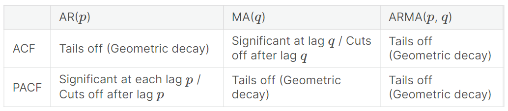 
``` 

### AR(1) 
As an example, the following times series meets the pre-condition of stationarity.\

**Time Series**
```{r} 
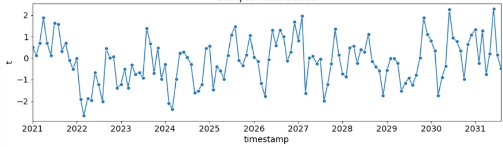 
``` 

**ACF**
```{r} 
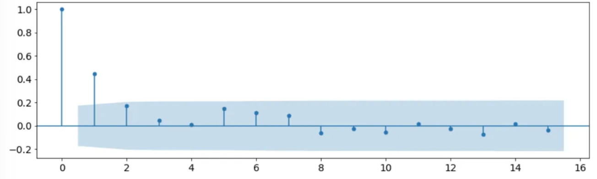 
``` 

**PACF**
```{r} 
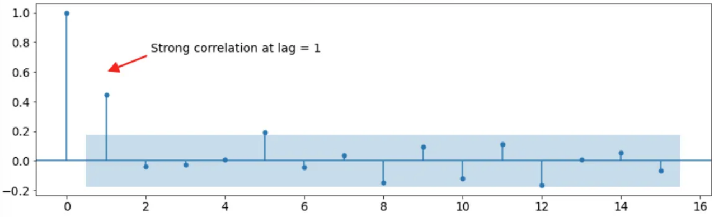 
``` 
We can draw the following conclusions from the analysis of the time series:\

- The non-zero values of several auto-correlations indicate that the time series is not random.\

- The PACF plot reveals a high degree of autocorrelation between adjacent lags, specifically at lag 1.\

- The ACF plot shows a geometric decay.\

As $AR(1)$, the formula is as follows: $\hat{y}_t = \alpha_1y_{t-1}$.

### AR(2)
The second time series meets the pre-condition of stationarity.\

**Time Series**
```{r} 
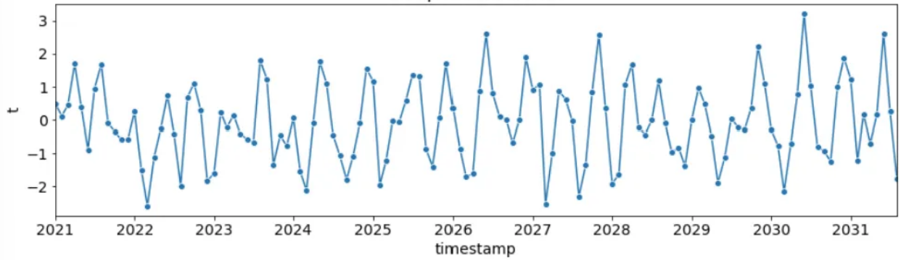 
``` 

**ACF**
```{r} 
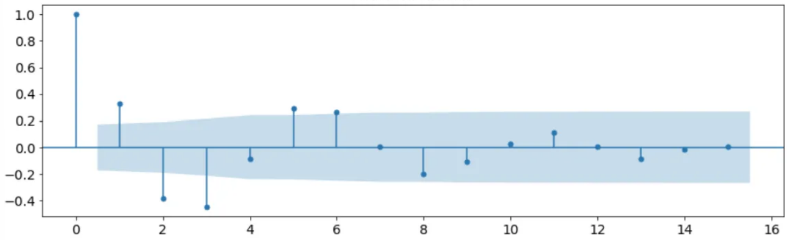 
``` 

**PACF**
```{r} 
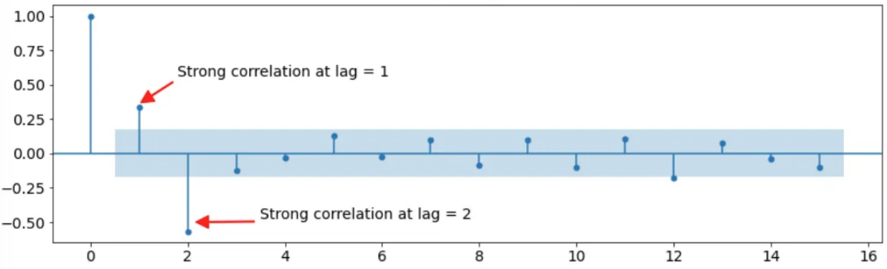 
``` 

Based on the analysis, we can conclude that the time series is non-random as there are several significantly non-zero auto-correlations. The PACF plot reveals a high degree of auto-correlation between adjacent (lag = 1) and near-adjacent (lag = 2) observations, indicating a non-random time series.
Our examination of the ACF plot shows a geometric decay pattern.\

$AR(2)$ displays the formula as such: $\hat{y}_t = \alpha_1y_{t-1} + \alpha_2y_{t-2}$.

### MA(1)
For an $MA(1)$ process, the PACF is 
The time series continues to be stationary.\

**Time Series**
```{r} 
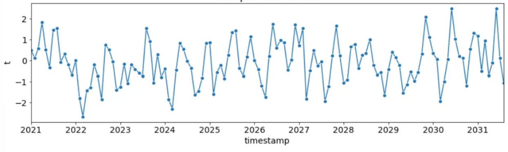 
``` 

**ACF**
```{r} 
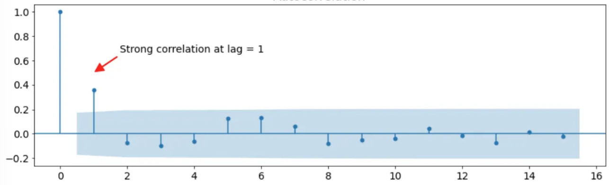 
``` 

**PACF**
```{r} 
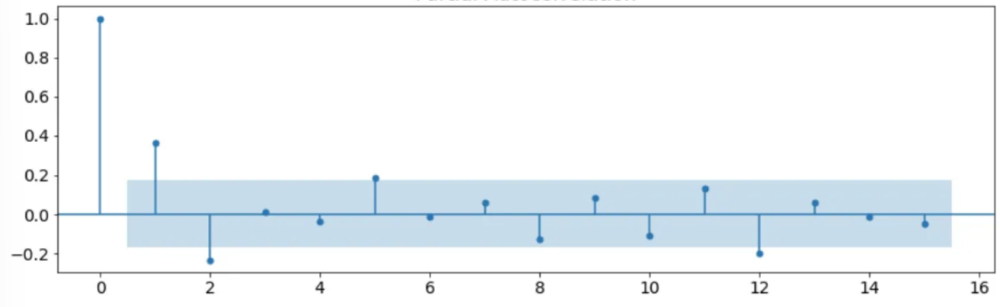 
``` 

We can draw the following conclusions from the analysis of the time series:\

- The non-zero values of several auto-correlations indicate that the time series is not random.\

- The ACF plot reveals a high degree of autocorrelation between adjacent lags, specifically at lag 1.\

- The PACF plot shows a geometric decay.\

With $MA(1)$, the formula is $\hat{y}_t = \epsilon_t + \beta_1\epsilon_{t-1}$.

### MA(2)
The Moving Average Model of q = 2 is stationary.\

**Time Series**
```{r} 
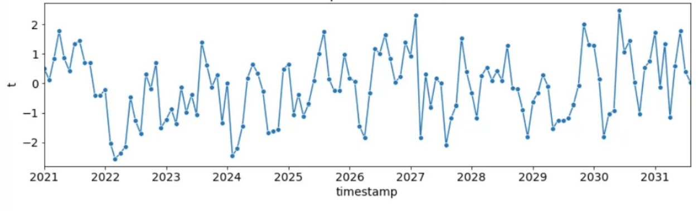 
``` 

**ACF**
```{r} 
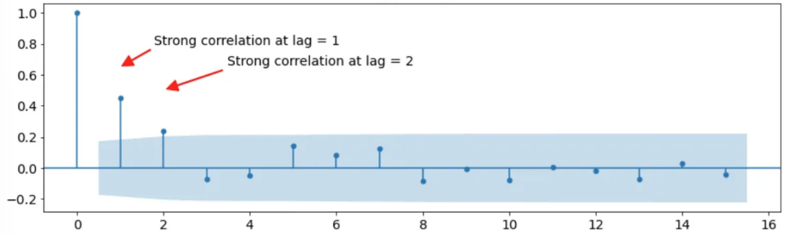 
``` 

**PACF**
```{r} 
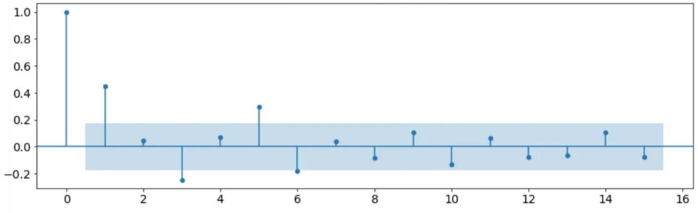 
``` 

Based on the analysis, we can conclude that the time series is non-random as there are several significantly non-zero auto-correlations. The ACF plot reveals a high degree of auto-correlation between adjacent (lag = 1) and near-adjacent (lag = 2) observations, indicating a non-random time series. The examination of the PACF plot shows a geometric decay pattern.\

$MA(2)$ displays the formula as : $\hat{y}_t = \epsilon_t + \beta_1\epsilon_{t-1} + \beta_2\epsilon_{t-2}$.

**Note**: From the textbook, they state that in terms of these two $ARIMA$ models, $ARIMA(p, d, 0) or $ARIMA(0, d, q)$ model, then the ACF and PACF plots can be helpful in determining the value of  
$p$ or $q$. If both are positive, then the plots do not help in finding suitable values of $p$ and $q$.

### Seasonlity
When there is a seasonality component within the $ARIMA$ model, the periodical element needs to be analyzed as a $m$ is added. For instance, when a series has monthly data, the ACF and PACF plots will show a strong correlation with the adjacent observation (lag = 1) and also at lag - 12, which is the value of $T$. This can be seen in the plots below.

**Times Series**
```{r} 
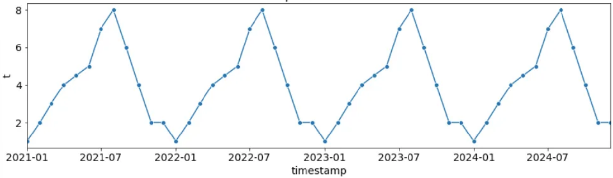 
``` 

**ACF**
```{r} 
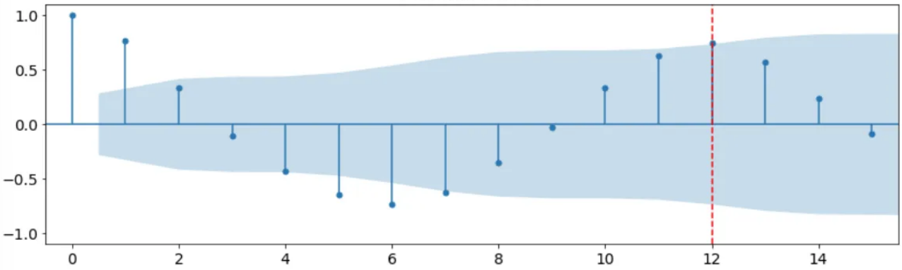 
``` 

**PACF**
```{r} 
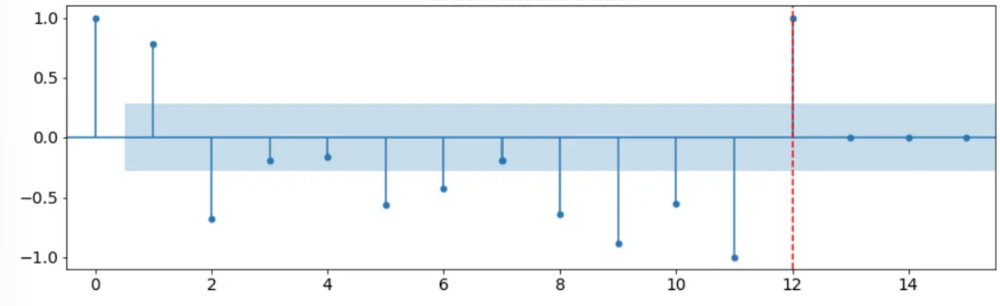 
``` 

## Summary
The auto-correlation function (ACF) is a measure of the correlation between a time series and a lagged version of itself. It quantifies the relationship between an observation at a certain time point and the observations at previous time points. The ACF begins at lag 0, which is the correlation of the time series with itself and always equals 1. To determine the order of an $MA$ model, it is necessary to examine the ACF. On the other hand, the partial auto-correlation function at lag $k$ is the auto-correlation explained by every successive lagged term [4]. The PACF though helps to identify the $AR$ model. Both are assumed to be stationary, and that is why for an ARIMA model, differencing or integrating is necessary because that time series is not stabilized. Within each of the plots, there is a 95% confidence interval and is an indicator for the significance threshold. In addition, both have a range from -1 to 1, indicating a strong correlation on either end while a value near 0 corresponds to a weak relationship. 

## Modeling 
```{r, message = FALSE, warning = FALSE}
library(fpp3)
library(ggplot2)
library(tsibble)
library(dplyr)
library(scales)
library(patchwork)
```


**Description**: `us_employment` is a monthly `tsibble` containing US employment data from January 1939 to June 2019. Each `Series_ID` represents different sectors of the economy.

### Exploratory Analysis
```{r}
?us_employment # Review 
class(us_employment) # Check the type of object, ts
head(us_employment)

LandH <- us_employment |>
  filter(Title == "Leisure and Hospitality")

# Check number of missing values (1, removed Growth)
sum(is.na(LandH)) # 0 values

# Keep only Month, Title and Employed
LandH_Emp <- LandH[,c(1,3,4)]

rm(LandH)
```

```{r, message = FALSE, warning = FALSE, fig.dim = c(10, 6)}
# Plot the US Leisure and Hospitaility employment data, Section 9.9
LandH_Emp |> 
  mutate(Employed = Employed/1000) |>
  select(Month, Employed)
autoplot(LandH_Emp, Employed) +
  labs(title = "US Employment: Lesiure and Hospitality",
       y = "Number of People (millions)") + 
  scale_y_continuous(labels = comma) +
  theme_minimal()
```

The time series appears to be non-linear upward trend with seasonality. The variance prior to 1990 is much less drastic than the years afterwards. Within the variance, the amplitudes seem to be consistent within those two distinct periods. Since this data is not stationary, we must explore possible transformation and differencing. 

### Transformation Analysis
```{r, message = FALSE, warning = FALSE, fig.dim = c(10, 6)}
#Box-Cox Transformation
lambda <- LandH_Emp |>
  features(Employed, features = guerrero) |>
  pull(lambda_guerrero)

private_lambda <- LandH_Emp |>
  autoplot(box_cox(LandH_Emp$Employed, lambda)) +
  labs(y = "Number of People (millions)",
       title = latex2exp::TeX(paste0(
         "Transformed Employed with $\\lambda$ = ",
         round(lambda,2)))) + theme_minimal()

private_lambda
```

In the Box-Cox transformation, when $\lambda$ is close to zero, then the a natural logarithm would be used. Otherwise, a power transformation is utilized with some simple scaling. This automatic process is not always straightforward as it may confuse the changing seasonality with the increasing variance. Therefore, we explore other alternatives. 

```{r, message = FALSE, warning = FALSE, fig.dim = c(10, 6)}
par(mfrow = c(1, 2))

sqrt <- LandH_Emp |>
  autoplot(sqrt(Employed)) +
  theme_minimal()

log <- LandH_Emp |>
  autoplot(log(Employed)) +
  theme_minimal()

sqrt + log
```

Since the variation is not constant over time, there should be an attempt to reduce the impact of those larges values that may be more suitable. Since the variation changes slightly as the level increases, the square root transformation may be more appropriate. 

```{r, message = FALSE, warning = FALSE, fig.dim = c(10, 6)}
# STL decomposition with no data transformation
no_trans <- LandH_Emp |>
  model(STL(Employed ~ season(window = 7))) |>
  components() |>
  autoplot() + theme_minimal()

# STL decomposition with square root transform
sqrt2 <- LandH_Emp |>
  model(STL(sqrt(Employed) ~ season(window = 7))) |>
  components() |>
  autoplot() + theme_minimal()

# STL decomposition with log transform
log2 <- LandH_Emp |>
  model(STL(log(Employed) ~ season(window=7))) |>
  components() |>
  autoplot() + theme_minimal()

no_trans + sqrt2 + log2
```

Within all three SLT models, it is more apparent that the time series has a non-linear relationship as the trend curves upwards in the non-transformed. Therefore, a square root transformation may be suitable compared to the other options. In addition, the remainder appears to be random noise as no patterns emerge. The seasonality is unsurprising since national or local events could change the series over a long period of time.\

As mentioned previously, the time series is not stationary because there is a present trend. Therefore, we deploy differencing. 
```{r, message = FALSE, warning = FALSE, fig.dim = c(10, 6)}
# Seasonal difference
LandH_Emp |>
  autoplot(sqrt(Employed) |> 
    difference(lag = 12)) + #  Monthly data
      theme_minimal()
```

```{r}
# KPSS test
LandH_Emp |>
  mutate(diff = difference(Employed, lag = 12) ) |>  # seasonal difference
  features(diff, unitroot_kpss)
```

Although this KPSS test was not outlined above, we briefly describe it now. The KPSS test is used to determine whether a time series is stationary, with the null hypothesis being that the data are stationary. The test aims to find evidence that the null hypothesis is false, with small p-values (less than 0.05) indicating that differencing is required. The resulting KPSS test p-value ranges between 0.01 and 0.1. If the actual p-value is less than 0.01, it is displayed as 0.01, and if the actual p-value is greater than 0.1, it is displayed as 0.1. In this case, the p-value is reported as 0.01 (and may be even smaller), indicating that the null hypothesis is rejected, and therefore, the data is not stationary. To address this issue, we continue to difference, and the KPSS test can be conducted again.

```{r, message = FALSE, warning = FALSE, fig.dim = c(10, 6)}
# Seasonal and first difference
LandH_Emp |>
  autoplot(sqrt(Employed) |> 
             difference(lag=12) |>  #  Monthly data
               difference()) +
                theme_minimal()
```

The double difference appears to have stablized the time series.

```{r}
# KPSS test
LandH_Emp  |>
  mutate(diff = difference(Employed, lag = 12) |>  
             difference())  |>  # seasonal and first difference 
  features(diff, unitroot_kpss)
```

After differencing once with seasonality and the first difference, the resulting p-value has reached 0.1. Now, we analyze the ACF and PACF charts to try to fit the best model. 

```{r, message = FALSE, warning = FALSE, fig.dim = c(10, 6)}
# ACF and PACF Plots
LandH_Emp |>
  gg_tsdisplay(sqrt(Employed) |> 
      difference(lag = 12) |> 
          difference(), 
               plot_type = "partial") 
```

As mentioned in the theory, there are either two or three components that will be needed for the model. Since we have differenced, it is already known that $d$ will play a part. Next, the ACF and PACF plots need to be reviewed to choose the optimal $p$ for $AR$ and $q$ for $MA$. Within the PACF, which is used for the auto-regression portion, it is noticed that there that the first significant spike is at lag 2. Therefore, $p$ will be 2. In the ACF plot shows a significant spike at 2 again, meaning that the $MA$ portion of the model for $q = 2$. If the data did not need differening, then the model would have been an $ARMA$ instead of an $ARIMA$. It would appear that the optimal model would then be $ARIMA(2, 1, 2)(0, 1, 1)$. The second set of parenthesis is in reference to the seasonality, $(P, D, Q)$. We analyze the exponential decay in both plots and notice that there is exponential decay for $q$. Now, we fit the model against the auto to compare the lowest AICc. 

```{r}
# Model Selection
fit <- LandH_Emp |>
  model(
    arima210011 = ARIMA(sqrt(Employed) ~ pdq(2,1,2) + PDQ(0,1,1)),
    auto = ARIMA(sqrt(Employed))
  )
glance(fit)
```

Typically, an analyst would choose multiple models to test and compare the fit metrics. Since this is just an exercise, we shortened it since the theory explained the overarching concepts. The one thing to point out from this output is the `auto` model. Here, we see that the AICc's are the same, and that is because we choose the same optimal model that was automatically computed to find the best outcome. Therefore, we move forward to check the residuals of this model.  

```{r}
# Residual Analysis
fit |>
  select(arima210011) |>
  gg_tsresiduals()
```

The residuals appear to be centered around zero and normally distributed. The one issue here though is that there is a significant spike in the ACF plot at lag 11 while others follow in its path.\

From the *Fitting Series Procedure* section, step 8 was to use the model to forecast. To find more information about this topic, please refer to the course's textbook. 

# Resources

-   [1] [https://www.researchgate.net/publication/327567755_Model_Selection_Process_in_Time_Series_Analysis_of_Production_System_with_Random_Output\\](https://www.researchgate.net/publication/327567755_Model_Selection_Process_in_Time_Series_Analysis_of_Production_System_with_Random_Output\){.uri}\
    
-   [2] https://medium.com/analytics-vidhya/arima-fc1f962c22d4#:~:text=Differencing%20is%20a%20method%20of,and%20the%20previous%20time%20period.\

- [3] https://towardsdatascience.com/interpreting-acf-and-pacf-plots-for-time-series-forecasting-af0d6db4061c\

- [4] https://www.kaggle.com/code/iamleonie/time-series-interpreting-acf-and-pacf\

- [5] Forecasting Course Lecture PowerPoint